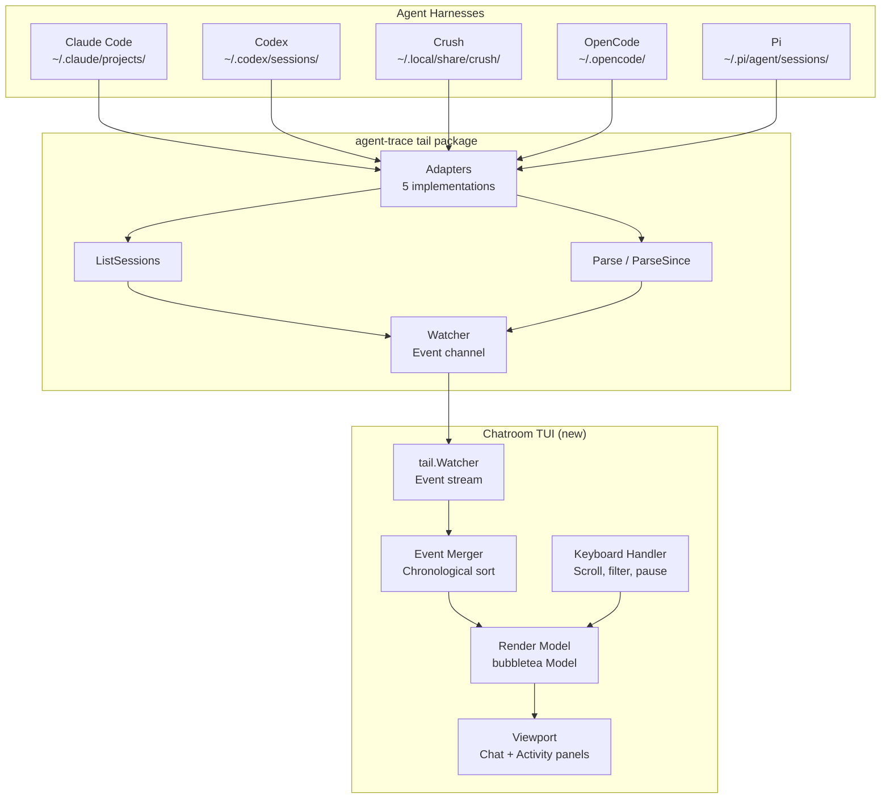

# ADR-0001: Unified Chatroom TUI for Multi-Harness Agent Output

## Context and Problem Statement

How can we provide a unified, real-time "chatroom" style read-only TUI that aggregates output from all agent harnesses (Claude Code, Codex, Crush, OpenCode, Pi) into a single stream where each harness appears as a distinct "user" (e.g., `@crush-signal`, `@claude-code`) with their tool calls, results, and user messages displayed as chat messages and activity feed entries?

## Decision Drivers

* **Observability**: Developers run multiple agent harnesses simultaneously and need a single pane of glass to monitor all activity
* **Unified timeline**: Tool calls, results, and user messages from different harnesses should be interleaved chronologically
* **Harness identity**: Each harness should have a distinct visual identity (username/color) in the chatroom
* **Read-only**: The TUI is for monitoring only — no input/interaction
* **Leverage existing infrastructure**: agent-trace's `tail` package already parses all harness formats and emits normalized `Event` streams
* **Real-time updates**: Must reflect live activity as it happens across all harnesses

## Considered Options

* **Option 1: Build a new TUI from scratch using bubbletea/bubbles**
  * Pros: Full control, native TUI feel, can integrate directly with tail.Watcher
  * Cons: Significant development effort, need to handle rendering, scrolling, layout

* **Option 2: Extend existing agent-trace with a simple terminal dashboard**
  * Pros: Reuses all parsing/classification logic, minimal new code
  * Cons: Limited to what tail.Watcher provides, may need enhancement for TUI-specific features

* **Option 3: Pipe tail output to an existing log viewer (lnav, less +F)**
  * Pros: Zero development, powerful filtering/search
  * Cons: No harness-aware formatting, no chatroom metaphor, no activity feed entries

* **Option 4: Web-based dashboard served locally**
  * Pros: Rich UI, easier layout, can use existing web components
  * Cons: Requires browser, not a TUI, more complex deployment

## Decision Outcome

Chosen option: **Option 1 — Build a new TUI from scratch using bubbletea/bubbles**, because it provides the best balance of native terminal experience, harness-aware formatting, and real-time chatroom metaphor while fully leveraging agent-trace's existing tail.Watcher and classification pipeline.

### Consequences

* Good, because: Native TUI experience with proper keyboard navigation, scrolling, and layout
* Good, because: Full control over chatroom rendering — messages, activity feed, harness colors
* Good, because: Direct integration with tail.Watcher's Event channel for real-time updates
* Bad, because: New dependency on bubbletea/bubbles (well-maintained, MIT licensed)
* Bad, because: Significant initial development effort for TUI framework

### Confirmation

* TUI launches and connects to tail.Watcher with DefaultAdapters()
* Events from all 5 harnesses appear in unified chronological stream
* Each harness shows as distinct username (e.g., `@crush-signal`, `@claude-code`)
* Tool calls render as chat messages with action/type badges
* Tool results render as follow-up messages with status indicators
* User messages (marks) render as chat messages
* Activity feed panel shows summary timeline
* Keyboard controls: scroll, pause/resume, filter by harness, quit

## Pros and Cons of the Options

### Option 1: Build a new TUI from scratch using bubbletea/bubbles

* Good, because: Native TUI experience with proper terminal handling
* Good, because: Full control over chatroom metaphor and harness visualization
* Good, because: Direct integration with tail.Watcher Event channel
* Good, because: bubbletea is mature, well-documented, actively maintained
* Neutral, because: Requires learning bubbletea patterns if unfamiliar
* Bad, because: New codebase to maintain alongside agent-trace
* Bad, because: Terminal rendering edge cases (resize, colors, Unicode)

### Option 2: Extend existing agent-trace with a simple terminal dashboard

* Good, because: Reuses all existing parsing logic
* Good, because: Minimal new dependencies
* Neutral, because: Limited to text-based output, no rich TUI interactions
* Bad, because: No proper scrolling, layout, or keyboard handling
* Bad, because: Hard to achieve chatroom metaphor with simple print statements

### Option 3: Pipe tail output to an existing log viewer

* Good, because: Zero development effort
* Good, because: Powerful filtering/search built-in
* Bad, because: No harness-aware formatting or chatroom metaphor
* Bad, because: No activity feed panel
* Bad, because: Not a unified "chatroom" experience

### Option 4: Web-based dashboard served locally

* Good, because: Rich UI capabilities, easier layout
* Good, because: Can leverage web component libraries
* Bad, because: Not a TUI — requires browser
* Bad, because: More complex deployment (HTTP server, static assets)
* Bad, because: Doesn't meet "TUI" requirement

## Architecture Diagram

## More Information

* Related to SPEC-0001 which formalizes the requirements for the chatroom TUI
* Leverages existing `tail.Watcher`, `tail.Adapter`, `tail.Event`, `classify.Event`, `classify.Mark` types
* New TUI will be a separate binary/cmd in agent-trace (e.g., `cmd/chatroom`)
* Uses bubbletea (github.com/charmbracelet/bubbletea) and bubbles (github.com/charmbracelet/bubbles)
* Harness usernames: `@claude-code`, `@codex`, `@crush-signal`, `@opencode`, `@pi`
* Color scheme per harness for visual distinction