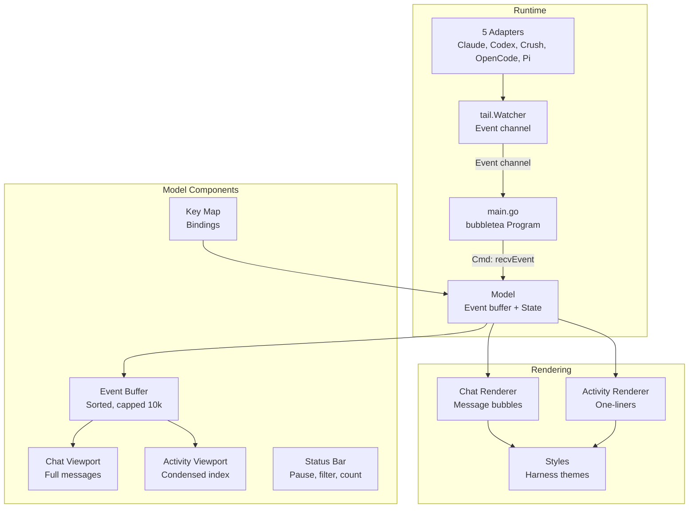

# Design: Unified Chatroom TUI for Multi-Harness Agent Output

## Context

This design implements SPEC-0001, which specifies a unified "chatroom" TUI for monitoring multiple agent harnesses. The TUI consumes events from `tail.Watcher` (which aggregates from 5 harness adapters) and renders them as a chronological chat stream with an activity feed panel.

Key existing components leveraged:
- `tail.Watcher` — polls adapters, emits `tail.Event` channel
- `tail.Adapter` — 5 implementations (Claude Code, Codex, Crush, OpenCode, Pi)
- `tail.Event` — pairs `SessionMeta` + `classify.Event` + `classify.Mark[]`
- `classify.Event` — classified tool call/result with `Action`, `Targets`, `Summary`, `Timestamp`
- `classify.Mark` — user messages, compactions, subagent launches

New components:
- `cmd/chatroom` — main entry point, bubbletea application
- `internal/chatroom/model.go` — bubbletea Model with event processing
- `internal/chatroom/view.go` — rendering logic for chat + activity panels
- `internal/chatroom/styles.go` — color schemes, harness themes
- `internal/chatroom/keymap.go` — keyboard bindings

## Goals / Non-Goals

### Goals

- Real-time unified chat stream from all 5 harnesses
- Distinct visual identity per harness (username + color)
- Tool calls, results, and user messages as chat messages
- Activity feed panel with navigation
- Full keyboard navigation (scroll, pause, filter, quit)
- Terminal resize handling
- High-contrast and reduced-motion accessibility modes
- Clean integration with existing `tail.Watcher` API

### Non-Goals

- Interactive input (sending messages to harnesses)
- Session replay from historical data (live only for v1)
- Web-based dashboard
- Plugin system for custom harnesses
- Persistent configuration file (env vars only for v1)
- Multi-window/tab support

## Decisions

### Decision: Bubbletea Framework

**Choice**: Use `github.com/charmbracelet/bubbletea` and `github.com/charmbracelet/bubbles` for TUI framework.

**Rationale**: 
- Mature, actively maintained, MIT licensed
- Built-in support for async event processing (commands)
- Viewport component handles scrolling efficiently
- Lipgloss for styling matches our color/theme needs
- Used by other StumpCloud tools (consistency)

**Alternatives considered**:
- `tview`/`tcell`: More low-level, more boilerplate for chat UI
- `termui`: Less active maintenance
- Raw ANSI + custom loop: Reinventing viewport, input handling, resize

### Decision: Event Merger in Model

**Choice**: The bubbletea Model maintains a merged, sorted event buffer. Events from `Watcher.Events()` channel are received via a bubbletea `Cmd` that forwards to `Model.Update()`.

**Rationale**:
- `Watcher.Events()` delivers events in approximate chronological order per adapter, but not globally sorted across adapters
- Model merges by `Event.Classified.Timestamp` (fallback `Event.ReceivedAt`)
- Buffer capped at 10,000 events to bound memory
- Sort on each insert is O(n) but n is small; can optimize to heap if needed

**Alternatives considered**:
- Pre-sort in watcher: Watcher doesn't have global view across adapters
- External merger process: Unnecessary complexity

### Decision: Harness Theme Configuration

**Choice**: Hardcoded theme map in `styles.go` with env var override for high contrast.

**Rationale**:
- Only 5 harnesses, fixed set
- Colors chosen for terminal visibility (256-color safe)
- High-contrast mode swaps to bold/underline + white text

**Alternatives considered**:
- Config file: Overkill for v1
- Auto-detect terminal palette: Unreliable

### Decision: Activity Feed as Separate Viewport

**Choice**: Two `bubbles/viewport` components side-by-side (or stacked on narrow terminals): main chat (70%) + activity feed (30%).

**Rationale**:
- Activity feed is a condensed index, not full content
- Clicking activity entry → scroll chat to that event (via `Viewport.SetYOffset`)
- Shared event buffer, different render functions

**Alternatives considered**:
- Single viewport with tabs: Loses simultaneous visibility
- Popup overlay: Harder to navigate

### Decision: Keyboard Navigation Scheme

**Choice**: Vim-like keys (`j`/`k`, `g`/`G`, `Ctrl+u`/`Ctrl+d`) plus `Space` for pause, `1-5` for harness filter, `Tab` for panel focus, `q`/`Ctrl+c` for quit.

**Rationale**:
- Familiar to developers
- `1-5` maps directly to 5 harnesses
- `Tab` for panel switching is standard

**Alternatives considered**:
- Arrow keys only: Less efficient for power users
- Command palette: Overkill for 6 actions

## Architecture



### Data Flow

1. `main.go` creates `tail.Watcher` with `DefaultAdapters()` and `DefaultWatchConfig()`
2. `main.go` starts `Watcher.Start(ctx)` in a goroutine
3. `main.go` runs `tea.NewProgram(Model{...}, tea.WithAltScreen())`
4. Model's `Init()` returns a `Cmd` that reads from `Watcher.Events()` and sends `MsgEvent` to `Update()`
5. `Update(MsgEvent)` inserts event into sorted buffer, triggers re-render
6. `View()` renders chat viewport + activity viewport + status bar using Lipgloss
7. Keyboard input → `Update(MsgKey)` → modifies model state (scroll, filter, pause) → re-render

### Event Buffer

```go
type EventBuffer struct {
    events    []RenderableEvent // sorted by timestamp
    maxSize   int               // 10000
    filter    HarnessFilter     // bitmask of visible harnesses
    paused    bool              // auto-scroll paused
    focus     PanelFocus        // Chat | Activity
}
```

`RenderableEvent` wraps `tail.Event` with pre-computed render data (formatted strings, styles) to avoid re-formatting on every frame.

## Risks / Trade-offs

- **Risk**: High event volume could cause UI lag
  - **Mitigation**: Buffer cap, batched renders, `RenderableEvent` pre-formatting
- **Risk**: Terminal resize during heavy event flow
  - **Mitigation**: bubbletea handles resize natively; Model recalculates layout on `tea.WindowSizeMsg`
- **Risk**: SQLite adapters (Crush, OpenCode) may lock database during long polls
  - **Mitigation**: Watcher uses read-only connections; incremental parsing reduces parse time
- **Trade-off**: Live-only (no historical replay) for v1
  - **Rationale**: Simplifies buffer management; replay can be added as `--since` flag later

## Migration Plan

Greenfield — new `cmd/chatroom` binary. No migration needed.

## Open Questions

1. Should the TUI support a `--since` flag to replay recent history on startup?
2. Should harness filter support multi-select (e.g., `1+3` for claude+crush) or single only?
3. Should we add a "follow" mode that auto-scrolls only when at bottom (like `tail -f`)?
4. Color palette: verify 256-color compatibility on common terminals (alacritty, kitty, iTerm2, Windows Terminal)
5. Should activity feed show marks (user messages) or only tool calls?